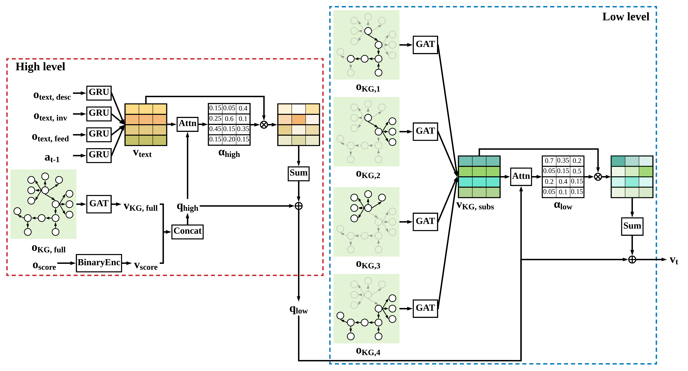

# SHA-KG



This repository contains official implementation for our NeurIPS2020 paper:

[Deep Reinforcement Learning with Stacked Hierarchical Attention for Text-based Games](https://arxiv.org/pdf/2010.11655.pdf)

Yunqiu Xu, Meng Fang, Ling Chen, Yali Du, Joey Tianyi Zhou and Chengqi Zhang


## Dependencies

+ Python 3.7
    + pytorch 1.3.1
    + gym 0.17.2
    + jericho 2.4.0
    + networkx 2.4
    + redis 3.4.1
+ Redis 4.0.14 
+ Standford CoreNLP 3.9.2


## Game environment

We use man-made games supported by Microsoft's [Jericho](https://github.com/microsoft/jericho). Folder ``roms`` contains original z-machine games provided by [BYU-PCCL/z-machine-games](https://github.com/BYU-PCCL/z-machine-games). Folder ``data`` contains entities and relations pre-defined by [rajammanabrolu/KG-A2C](https://github.com/rajammanabrolu/KG-A2C)


## How to train

+ Modify the port number for redis (default 6381) and corenlp (default 9010) in ``env.py``, ``openie.py`` and ``vec_env.py``
+ Modify the path of corenlp in ``train.py``
+ Launch redis and corenlp

+ Run the code

```python
python train.py
```

Different games may have different GPU memory requirement and running time. The game log and model will be saved at the output directory specified in ``train.py``.

## Citation

```
@article{xu20,
  title={Deep Reinforcement Learning with Stacked Hierarchical Attention for Text-based Games},
  author={Yunqiu Xu, Meng Fang, Ling Chen, Yali Du, Joey Tianyi Zhou, Chengqi Zhang},
  journal={CoRR},
  year={2020},
  url={https://arxiv.org/abs/2010.11655},
  volume={abs/2010.11655}
}
```


## Acknowledgement

We thank [rajammanabrolu/KG-A2C](https://github.com/rajammanabrolu/KG-A2C) for providing the excellent codebase. 

## License

[MIT License](https://github.com/YunqiuXu/SHA-KG/blob/main/LICENSE)
